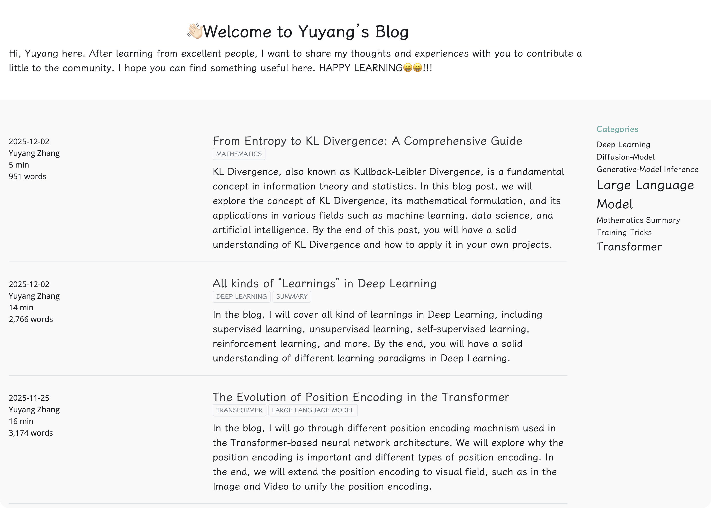

Hi, Yuyang is here 👋🏻👋🏻. This is github contain my personal projects and learning notes. It also contain my personal website. You can visit the website [here](https://yyzhang2025.github.io/). 

Below are some of projects you might be interested in:

- Stanford CS336 LLM from scratch: [\[Solution\]](https://github.com/YYZhang2025/Stanford-CS336) \[[Note\]](https://yyzhang2025.github.io/posts/LearningNotes/CS336/)
- 100 Papers with Code [\[Repository\]](https://github.com/YYZhang2025/100-AI-Code) [\[Note\]](https://yyzhang2025.github.io/posts/PapersWithCode/100_Papers_index.html)

Feel free to reach out to me via [email](mailto:zhangyuyang1211@gmail.com). 
